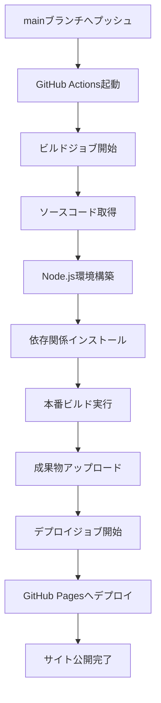

# GitHub Actions デプロイワークフロー解説

## 概要
GitHub Actionsは、CI/CD（継続的インテグレーション/継続的デプロイ）を実現する自動化プラットフォームです。
このプロジェクトでは、mainブランチへのプッシュ時に自動的にビルドとデプロイを行います。

## ワークフローファイル解説

### ファイル位置
```
.github/workflows/deploy.yml
```

### 完全なワークフロー解説

```yaml
name: Deploy to GitHub Pages

# ========== トリガー設定 ==========
on:
  # mainブランチへのプッシュ時に実行
  push:
    branches: [ main ]
  # 手動実行も可能（Actions タブから）
  workflow_dispatch:
```

**解説**：
- `push.branches`: mainブランチへのプッシュで自動実行
- `workflow_dispatch`: GitHub UIから手動実行可能

```yaml
# ========== 権限設定 ==========
permissions:
  contents: read        # リポジトリ内容の読み取り
  pages: write         # GitHub Pages への書き込み
  id-token: write      # OIDC トークン発行（デプロイ認証用）
```

**解説**：
- 最小権限の原則に従った設定
- GitHub Pagesデプロイに必要な権限のみ付与

```yaml
# ========== 並行実行制御 ==========
concurrency:
  group: "pages"              # 同じグループ内で並行実行を防ぐ
  cancel-in-progress: false   # 実行中のジョブをキャンセルしない
```

**解説**：
- 複数のデプロイが同時に走らないよう制御
- デプロイの整合性を保証

```yaml
jobs:
  # ========== ビルドジョブ ==========
  build:
    runs-on: ubuntu-latest    # 実行環境
    steps:
      # 1. ソースコードのチェックアウト
      - name: Checkout
        uses: actions/checkout@v4
        
      # 2. Node.js環境のセットアップ
      - name: Setup Node.js
        uses: actions/setup-node@v4
        with:
          node-version: '20'   # Node.js バージョン
          cache: 'npm'         # npm キャッシュ有効化
```

**解説**：
- `actions/checkout@v4`: リポジトリのコードを取得
- `actions/setup-node@v4`: Node.js環境構築、キャッシュで高速化

```yaml
      # 3. 依存関係のインストール
      - name: Install dependencies
        run: npm ci            # package-lock.json から正確にインストール
        
      # 4. プロダクションビルド
      - name: Build
        run: npm run build
        env:
          NODE_ENV: production # 本番環境用ビルド
```

**解説**：
- `npm ci`: `npm install`より高速で、本番向け
- `NODE_ENV=production`: 最適化されたビルド生成

```yaml
      # 5. GitHub Pages 設定
      - name: Setup Pages
        uses: actions/configure-pages@v4
        
      # 6. ビルド成果物のアップロード
      - name: Upload artifact
        uses: actions/upload-pages-artifact@v3
        with:
          path: ./dist         # ビルド出力ディレクトリ
```

**解説**：
- ビルド成果物を一時的に保存
- 次のデプロイジョブで使用

```yaml
  # ========== デプロイジョブ ==========
  deploy:
    environment:
      name: github-pages       # 環境名
      url: ${{ steps.deployment.outputs.page_url }}  # 公開URL
    runs-on: ubuntu-latest
    needs: build              # buildジョブ完了後に実行
    steps:
      - name: Deploy to GitHub Pages
        id: deployment
        uses: actions/deploy-pages@v4
```

**解説**：
- `needs: build`: ビルド成功後のみ実行
- 自動的にGitHub PagesへデプロイされURLが出力

## 実行フロー図



## 手動実行方法

### GitHub UI から実行

1. **Actions タブを開く**
   ```
   https://github.com/[ユーザー名]/[リポジトリ名]/actions
   ```

2. **ワークフローを選択**
   - 「Deploy to GitHub Pages」をクリック

3. **Run workflow をクリック**
   - Branch: main を選択
   - 「Run workflow」ボタンをクリック

### GitHub CLI から実行

```bash
# ワークフロー一覧表示
gh workflow list

# 手動実行
gh workflow run deploy.yml

# 実行状況確認
gh run list --workflow=deploy.yml

# 詳細ログ確認
gh run view [RUN_ID]
```

## 実行結果の確認

### 成功時の確認項目

1. **Actions タブ**
   - 緑色のチェックマーク ✓
   - 実行時間（通常1-2分）

2. **デプロイ先URL**
   ```
   https://[ユーザー名].github.io/[リポジトリ名]/
   ```

3. **実行ログ**
   - 各ステップの詳細な出力
   - エラーメッセージ（失敗時）

## よくあるエラーと対処法

### 1. ビルドエラー

**エラー例**：
```
Error: Cannot find module 'xxx'
```

**対処法**：
- package.json の依存関係を確認
- `npm install` を実行してローカルで確認

### 2. Pages 設定エラー

**エラー例**：
```
Error: Get Pages site failed
```

**対処法**：
- Settings → Pages で GitHub Actions を選択
- 権限設定を確認

### 3. パス設定エラー

**エラー例**：
```
404 Not Found
```

**対処法**：
- vite.config.ts の base 設定確認
- dist ディレクトリの構造確認

## カスタマイズ例

### ビルド前にテスト実行

```yaml
- name: Run tests
  run: npm test
  
- name: Build
  run: npm run build
```

### 複数環境へのデプロイ

```yaml
on:
  push:
    branches: 
      - main        # 本番環境
      - develop     # 開発環境
```

### Slack通知の追加

```yaml
- name: Slack Notification
  uses: 8398a7/action-slack@v3
  with:
    status: ${{ job.status }}
    webhook_url: ${{ secrets.SLACK_WEBHOOK }}
```

## ベストプラクティス

1. **シークレットの利用**
   - APIキーなどは GitHub Secrets に保存
   - `${{ secrets.SECRET_NAME }}` で参照

2. **キャッシュの活用**
   - node_modules のキャッシュで高速化
   - ビルドキャッシュの利用

3. **並列実行**
   - 独立したジョブは並列実行
   - matrix strategy で複数環境テスト

4. **エラー通知**
   - 失敗時の通知設定
   - 詳細なログ出力

## 参考リンク

- [GitHub Actions 公式ドキュメント](https://docs.github.com/actions)
- [actions/deploy-pages](https://github.com/actions/deploy-pages)
- [Vite デプロイガイド](https://ja.vitejs.dev/guide/static-deploy.html#github-pages)